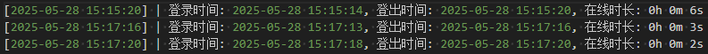
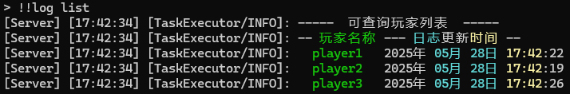
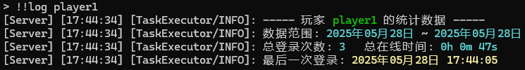
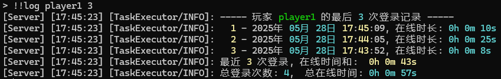

## 可爱日志记录器

### 插件说明

该插件会记录玩家的登录/登出服务器时间，并计算在线时长。结果会写入插件自动创建的日志文件

附日志文件解析器，是一款十分适合服务器撕逼时的在(工)线(作)时(量)长查证工具 😄

插件由2个模块构成，记录器（Logger）与解析器（Parser）


##### 记录器（Logger）：

插件加载后静默运行。玩家首次上线时创建日志文件，下线后写入日志。

每位玩家都会拥有一个独立的日志（是的你没听错 :)

写入格式如下：




##### 解析器（Parser）：

解析器用于在游戏内解析日志文件，可查看记录器生产的可操作玩家、统计信息、与最近登录信息。

查看可操作玩家：



查看统计信息：



查看最近登录信息：




### 指令、变量与文件结构：

##### 指令：

`!!log <command> <args>(optional)` : 基础命令格式

`!!log list` ：以列表方式显示解析器可操作的玩家对象

`!!log help` ：显示帮助信息


当 `<command>`字段不为 `list、help` 时，该字段作为输入的玩家名使用，规则如下：

1. 当字段 `<args>` 不存在时，输出玩家的全部统计数据；

   `!!log player` ：输出玩家 player 的统计数据


   

2. 当字段 `<args>` 值  ≤100 时，输出玩家的最近 xx 次的登录日志；

   `!!log player 10` ：以列表方法显示玩家 player 最近 10 次登录日志


   

3. 当字段 `<args>` 值 >100 时，将值按 `YYYYMMDD` 格式解析为日期，输出玩家以该日期为起始的统计数据；

   `!!log player 20250401` ：输出 player 从 `2025年4月1日` 起至今的统计数据


   

##### 变量：

​		变量以硬编码方法存储在插件py文件内，请直接修改插件文件（17行开始）。

```python
DEBUG = False			# DEBUG开关，开启后不会再游戏内输出信息，并在终端输出更多的信息。
PREFIX = "!!log"		# 插件指令前缀，用于在游戏内触发Parser交互。
LIST_PREFIX = "list"	# List功能触发词，用于当出现名为list的玩家时更换触发词。
```


##### 文件结构：

玩家日志存储目录：`~/MCDR/config/cute_log/`


### 使用方法

是的，这是一个Python单文件插件。

将 `cute_log.py` 文件放入 `~/MCDR/plugin/` 目录下，重载插件后即可正常工作。


